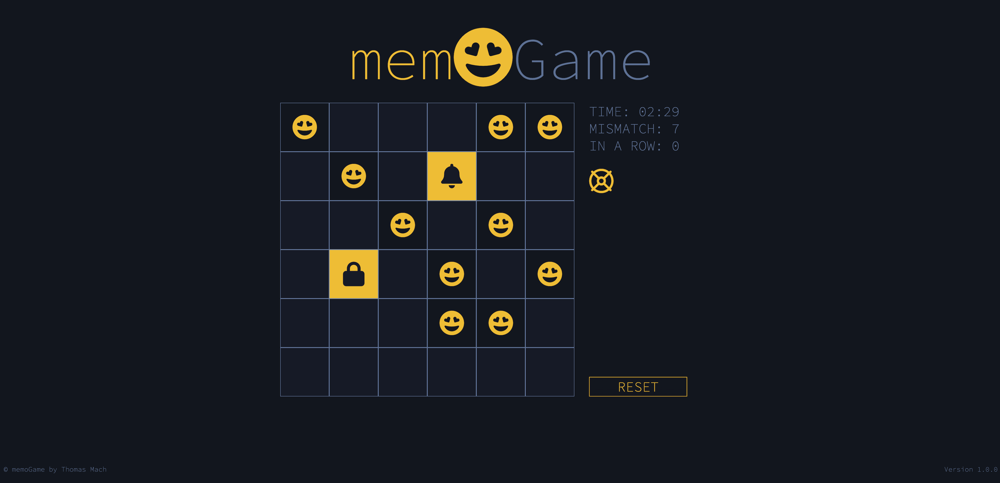

# Memo Game 🎮

Un classico gioco di memoria (Memo Game) sviluppato in JavaScript, HTML e CSS per esercitarmi nella creazione di giochi interattivi basati su griglie. Testa la tua memoria abbinando tutte le carte nel minor tempo possibile!

## [Gioca ora](https://thomas-mach.github.io/memo-game/)

## Caratteristiche 🛠

- Gioco interattivo con interfaccia dinamica.
- Timer con countdown.
- Animazioni CSS per hover e matching delle carte.
- Suoni interattivi per migliorare l'esperienza utente.
- Funzione di salvataggio in situazioni critiche (lifesaver).
- Effetti visivi di confetti al completamento del gioco.

## Tecnologie Utilizzate 🚀

- **JavaScript** per la logica del gioco e la gestione degli eventi.
- **HTML5** per la struttura del gioco.
- **CSS3** per lo stile e le animazioni delle carte e dell'interfaccia.
- **Audio MP3** per effetti sonori interattivi.

## Regole del Gioco 📝

1. Il gioco inizia con un tabellone di carte coperte.
2. Al clic su una carta, essa viene rivelata.
3. Trova le coppie di carte abbinate entro il tempo limite.
4. Ogni volta che trovi una coppia, viene conteggiata e rimossa dal tabellone.
5. Se non riesci a trovare una coppia, le carte si copriranno di nuovo.
6. Utilizza la funzione di salvataggio (lifesaver) per svelare momentaneamente tutte le carte se sei in difficoltà.

### Timer e Tentativi

- Hai **180 secondi** per completare il gioco.
- Il numero di tentativi viene conteggiato, così potrai sfidare te stesso a migliorare.
- Quando abbini correttamente le carte, accumuli combo (serie di abbinate consecutive).

### Suoni Interattivi 🔊

- **Effetto clic:** quando una carta viene selezionata.
- **Effetto abbinamento:** quando trovi una coppia.
- **Effetto "game over":** quando il tempo scade.
- **Effetto "vittoria":** se trovi tutte le coppie entro il tempo.

## Screenshot 📸

## Futuri Miglioramenti 🔧

- Aggiunta di livelli di difficoltà con più carte.
- Implementazione di una leaderboard per tracciare i tempi migliori dei giocatori.
- Miglioramento delle animazioni per un'esperienza utente più fluida.
- Aggiunta di modalità multiplayer per giocare con amici online.
